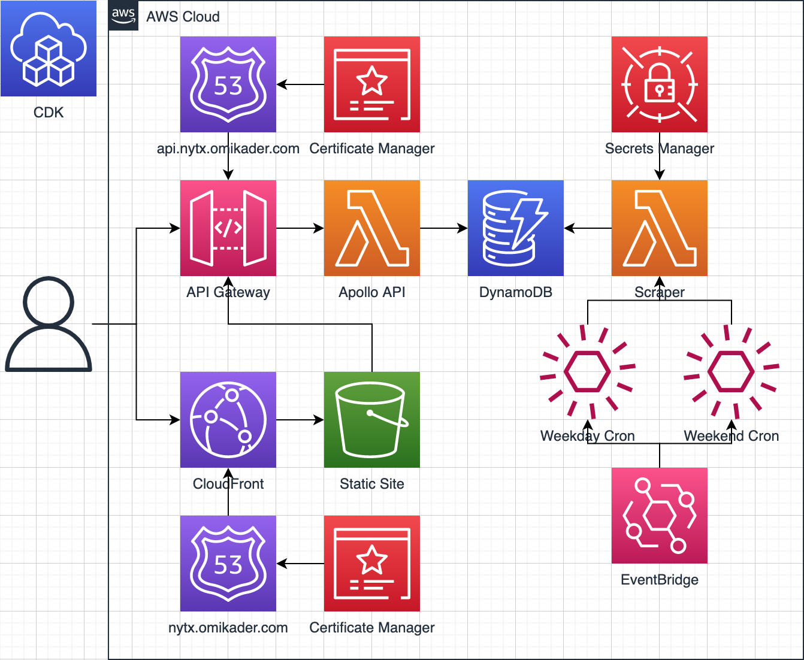

# nytx

My friends and I always race to see who can complete the New York Times Daily Mini the fastest -- but because the NYT only displays you and your friends’ results for the latest puzzle, there is no way to truly declare who the best puzzle solver is.

To solve this problem, I created [`nytx`](https://nytx.omikader.com), a serverless AWS application that aggregates my friends' Daily Mini results and computes our [TrueSkill](https://www.microsoft.com/en-us/research/project/trueskill-ranking-system/) rankings. Play with the API in your browser using the [_GraphQL Playground_](https://api.nytx.omikader.com).

## Serverless Stack

This project was bootstrapped with [Serverless Stack](https://docs.serverless-stack.com).

